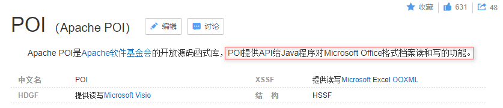
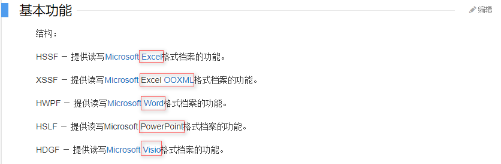
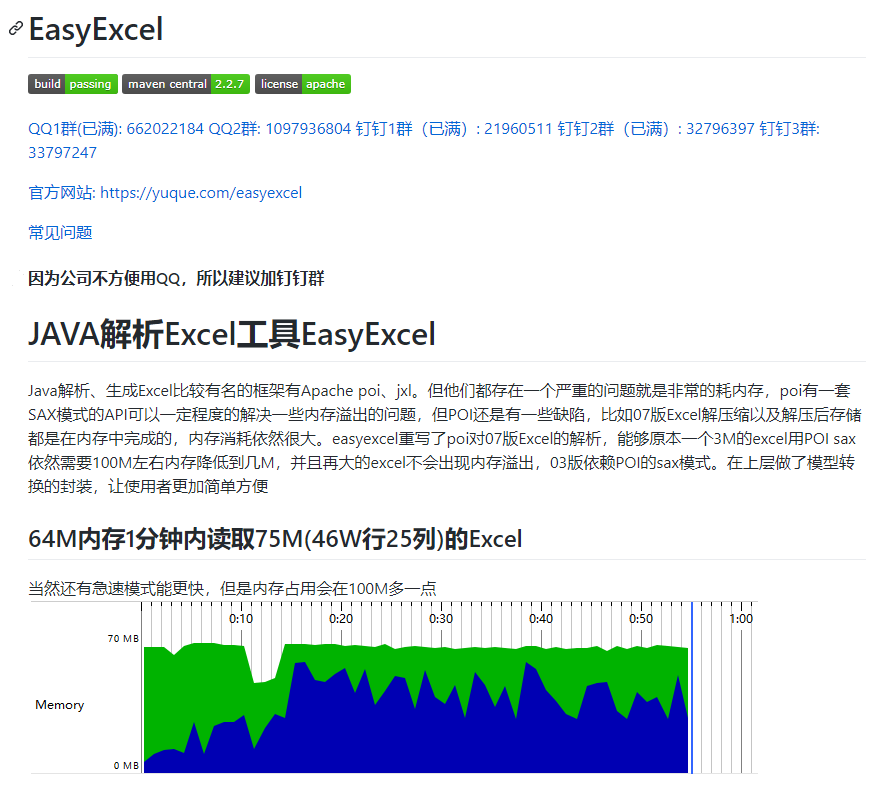
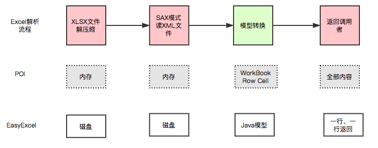
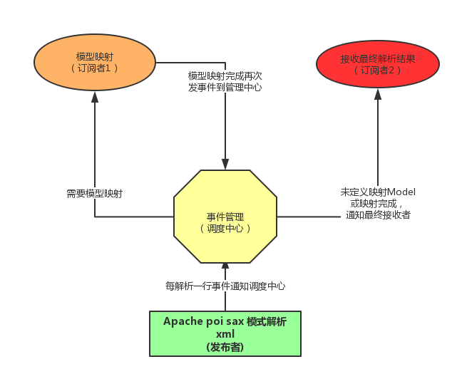

## POI 和 easyExcel 讲解

> 常用场景

1、将用户信息导出为excel表格（导出数据....)

2、将Excel表中的信息录入到网站数据库(习题上传...）大大减轻网站录入量!

开发中经常会设计到excel的处理，如导出Excel，Excel到数据库中!

操作Excel目前比较流行的就是Apache POI和阿里巴巴的easyExcel ! 

> Apache POI

Apache POI 官网：https://poi.apache.org/





> easyExcel

easyExcel 官网地址：https://github.com/alibaba/easyexcel



EasyExcel是阿里巴巴开源的一个excel处理框架，**以使用简单、节省内存著称**。

EasyExcel能大大减少占用内存的主要原因是在解析Excel时没有将文件数据一次性全部加载到内存中，而是从磁盘上一行行读取数据，逐个解析。

下图是EasyExcel和POI在解析Excel时的对比图。



采用sax模式一行一行解析，并将一行的解析结果以观察者的模式通知处理。




官方文档：https://www.yuque.com/easyexcel/doc/easyexcel


## POI-Excel 写

```java
private String path = "D:\\Project\\spring-advanced-study\\java-poi\\src\\main\\resources\\";
```

> 03版

```java
@Test
public void testWrite03() throws IOException {
    // 1、创建工作薄
    Workbook workbook = new HSSFWorkbook();
    // 2、创建工作表
    Sheet sheet = workbook.createSheet("03版工作表");
    // 3、创建行
    Row row1 = sheet.createRow(0);
    // 4、创建单元格（1,1）
    Cell cell11 = row1.createCell(0);
    cell11.setCellValue("今日新增观众");
    // （1,2）
    Cell cell12 = row1.createCell(1);
    cell12.setCellValue("666");
    // 第二行(2,1)
    Row row2 = sheet.createRow(1);
    Cell cell21 = row2.createCell(0);
    cell21.setCellValue("统计时间");
    // (2,2)
    Cell cell22 = row2.createCell(1);
    String time = new DateTime().toString("yyyy-MM-dd HH:mm:ss");
    cell22.setCellValue(time);
    // 生成一张表（io 流）
    FileOutputStream outputStream = new FileOutputStream(path + "菜鸡观众统计表03.xls");
    workbook.write(outputStream);
    // 关闭流
    outputStream.close();
    System.out.println("菜鸡观众统计表03，生成成功");
}
```

> 07版

```java
@Test
public void testWrite07() throws IOException {
    // 1、创建工作薄
    Workbook workbook = new XSSFWorkbook();
    // 2、创建工作表
    Sheet sheet = workbook.createSheet("07版工作表");
    // 3、创建行
    Row row1 = sheet.createRow(0);
    // 4、创建单元格（1,1）
    Cell cell11 = row1.createCell(0);
    cell11.setCellValue("今日新增观众");
    // （1,2）
    Cell cell12 = row1.createCell(1);
    cell12.setCellValue("666");
    // 第二行(2,1)
    Row row2 = sheet.createRow(1);
    Cell cell21 = row2.createCell(0);
    cell21.setCellValue("统计时间");
    // (2,2)
    Cell cell22 = row2.createCell(1);
    String time = new DateTime().toString("yyyy-MM-dd HH:mm:ss");
    cell22.setCellValue(time);
    // 生成一张表（io 流）
    FileOutputStream outputStream = new FileOutputStream(path + "菜鸡观众统计表07.xlsx");
    workbook.write(outputStream);
    // 关闭流
    outputStream.close();
    System.out.println("菜鸡观众统计表07，生成成功");
}
```

注意对象的一个区别，文件后缀！

> 大文件写 HSSF

缺点：最多只能处理65536行，否则会抛出异常

```java
java.lang.IllegalArgumentException: Invalid row number (65536) outside allowable range (0..65535)
```

优点：过程中写入缓存，不操作磁盘，最后一次性写入磁盘，速度快

```java
@Test
public void testWrite03BigData() throws IOException {
    long begin = System.currentTimeMillis();
    // 1、创建工作薄
    Workbook workbook = new HSSFWorkbook();
    // 2、创建工作表
    Sheet sheet = workbook.createSheet("03版工作表");
    for (int rowNum = 0; rowNum < 65536; rowNum++) {
        Row row = sheet.createRow(rowNum);
        for (int cellNum = 0; cellNum < 10; cellNum++) {
            Cell cell = row.createCell(cellNum);
            cell.setCellValue(cellNum);
        }
    }
    System.out.println("Over");
    // 生成一张表（io 流）
    FileOutputStream outputStream = new FileOutputStream(path + "菜鸡观众统计表03BigData.xls");
    workbook.write(outputStream);
    // 关闭流
    outputStream.close();
    long end = System.currentTimeMillis();
    System.out.println((double) (end - begin) / 1000);
}
```


> 大文件写XSSF

优点：写入数据是速度非常慢，非常耗内存，也会发生内存溢出，如100万条

缺点：可以写入比较大的数据量，如20万条

```java
@Test
public void testWrite07BigData() throws IOException {

    long begin = System.currentTimeMillis();
    // 1、创建工作薄
    Workbook workbook = new XSSFWorkbook();
    // 2、创建工作表
    Sheet sheet = workbook.createSheet("07版工作表");
    for (int rowNum = 0; rowNum < 100000; rowNum++) {
        Row row = sheet.createRow(rowNum);
        for (int cellNum = 0; cellNum < 10; cellNum++) {
            Cell cell = row.createCell(cellNum);
            cell.setCellValue(cellNum);
        }
    }
    System.out.println("Over");
    // 生成一张表（io 流）
    FileOutputStream outputStream = new FileOutputStream(path + "菜鸡观众统计表07BigData.xlsx");
    workbook.write(outputStream);
    // 关闭流
    outputStream.close();
    long end = System.currentTimeMillis();
    System.out.println((double) (end - begin) / 1000);
}
```


> 大文件写SXSSF

优点:可以写非常大的数据量，如100万条甚至更多条，写数据速度快，占用更少的内存

```java
@Test
public void testWrite07BigDataS() throws IOException {
    long begin = System.currentTimeMillis();
    // 1、创建工作薄
    Workbook workbook = new SXSSFWorkbook();
    // 2、创建工作表
    Sheet sheet = workbook.createSheet("07版工作表");
    for (int rowNum = 0; rowNum < 100000; rowNum++) {
        Row row = sheet.createRow(rowNum);
        for (int cellNum = 0; cellNum < 10; cellNum++) {
            Cell cell = row.createCell(cellNum);
            cell.setCellValue(cellNum);
        }
    }
    System.out.println("Over");
    // 生成一张表（io 流）
    FileOutputStream outputStream = new FileOutputStream(path + "菜鸡观众统计表07BigDataS.xlsx");
    workbook.write(outputStream);
    // 关闭流
    outputStream.close();
    // 清理临时文件
    ((SXSSFWorkbook) workbook).dispose();
    long end = System.currentTimeMillis();
    System.out.println((double) (end - begin) / 1000);
}
```

**注意∶**

过程中会产生临时文件，需要清理临时文件

默认由100条记录被保存在内存中，如果超过这数量，则最前面的数据被写入临时文件

如果想自定义内存中数据的数量，可以使用new SXSSFWorkbook(数量)

## POI-Excel 读

> 03 | 07

- 03版本

```java
@Test
public void testRead03() throws IOException {
    FileInputStream inputStream = new FileInputStream(path + "菜鸡观众统计表03.xls");
    // 得到工作薄
    Workbook workbook = new HSSFWorkbook(inputStream);
    // 得到工作表
    Sheet sheet = workbook.getSheetAt(0);
    // 得到行
    Row row = sheet.getRow(0);
    // 得到列
    Cell cell = row.getCell(1);
    // System.out.println(cell.getStringCellValue());
    System.out.println(cell.getNumericCellValue());
    inputStream.close();
}
```

- 07版本

```java
@Test
public void testRead07() throws IOException {
    FileInputStream inputStream = new FileInputStream(path + "菜鸡观众统计表07.xlsx");
    // 得到工作薄
    Workbook workbook = new XSSFWorkbook(inputStream);
    // 得到工作表
    Sheet sheet = workbook.getSheetAt(0);
    // 得到行
    Row row = sheet.getRow(0);
    // 得到列
    Cell cell = row.getCell(1);
    // System.out.println(cell.getStringCellValue());
    System.out.println(cell.getNumericCellValue());
    inputStream.close();
}
```

==注意获取的值得类型即可==

> 读取不同的数据类型

```java
@Test
public void testCellType() throws IOException {
    FileInputStream inputStream = new FileInputStream(path + "明细表.xls");
    // 得到工作薄
    Workbook workbook = new HSSFWorkbook(inputStream);
    // 得到工作表
    Sheet sheet = workbook.getSheetAt(0);
    // 得到行
    Row rowTitle = sheet.getRow(0);
    if (rowTitle != null){
        // 一定要掌握
        int cellCount = rowTitle.getPhysicalNumberOfCells();
        for (int cellNum = 0; cellNum < cellCount; cellNum++) {
            Cell cell = rowTitle.getCell(cellNum);
            if (cell!=null){
                int cellType = cell.getCellType();
                String cellValue = cell.getStringCellValue();
                System.out.print(cellValue + " | ");
            }
        }
        System.out.println();
    }
    int rowCount = sheet.getPhysicalNumberOfRows();
    for (int rowNum = 1; rowNum < rowCount; rowNum++) {
        Row rowData = sheet.getRow(rowNum);
        // 读取列
        int cellCount = rowData.getPhysicalNumberOfCells();
        for (int cellNum = 0; cellNum < cellCount; cellNum++) {
            System.out.print("["+(rowNum+1)+","+(cellNum+1)+"]");
            Cell cell = rowData.getCell(cellNum);
            if (cell!=null){
                int cellType = cell.getCellType();
                String cellValue = "";
                switch (cellType){
                    case HSSFCell.CELL_TYPE_STRING:
                        System.out.print("【STRING】");
                        cellValue = cell.getStringCellValue();
                        break;
                    case HSSFCell.CELL_TYPE_BOOLEAN:
                        System.out.print("【BOOLEAN】");
                        cellValue = String.valueOf(cell.getBooleanCellValue());
                        break;
                    case HSSFCell.CELL_TYPE_BLANK:
                        System.out.print("【BLANK】");
                        break;
                    case HSSFCell.CELL_TYPE_NUMERIC:
                        System.out.print("【NUMERIC】");
                        if (HSSFDateUtil.isCellDateFormatted(cell)){
                            System.out.print("【日期】");
                            Date date = cell.getDateCellValue();
                            cellValue = new DateTime(date).toString("yyyy-MM-dd");
                            break;
                        }else {
                            System.out.print("【转换为数字输出】");
                        }
                        cell.setCellType(HSSFCell.CELL_TYPE_STRING);
                        cellValue = cell.toString();
                        break;
                    case HSSFCell.CELL_TYPE_ERROR:
                        System.out.println("【数据类型错误】");
                        break;
                }
                System.out.println(cellValue);
            }
        }
        System.out.println();
    }
    inputStream.close();
}
```

`注意转换类型`

> 计算公式(了解即可)

```java
@Test
public void testFormula() throws IOException {
    FileInputStream inputStream = new FileInputStream(path + "明细表.xls");
    // 得到工作薄
    Workbook workbook = new HSSFWorkbook(inputStream);
    // 得到工作表
    Sheet sheet = workbook.getSheetAt(1);
    // 得到行
    Row row = sheet.getRow(4);
    Cell cell = row.getCell(0);
    // 拿到公式 eval
    HSSFFormulaEvaluator evaluator = new HSSFFormulaEvaluator((HSSFWorkbook) workbook);

    int cellType = cell.getCellType();
    switch (cellType) {
        case Cell.CELL_TYPE_FORMULA:
            String formula = cell.getCellFormula();
            System.out.println(formula);
            //        计算
            CellValue evaluate = evaluator.evaluate(cell);
            String cellValue = evaluate.formatAsString();
            System.out.println(cellValue);
            break;

    }

    inputStream.close();
}
```

## EasyExcel 操作

> 导入依赖

```xml

```

官方文档：https://www.yuque.com/easyexcel/doc/read


## 小结

