# 红黑树

**博客推荐**

blog01:https://zhuanlan.zhihu.com/p/139907457

blog02:https://blog.csdn.net/xiaofeng10330111/article/details/106080394?ops_request_misc=%257B%2522request%255Fid%2522%253A%2522163418603916780265456127%2522%252C%2522scm%2522%253A%252220140713.130102334..%2522%257D&request_id=163418603916780265456127&biz_id=0&utm_medium=distribute.pc_search_result.none-task-blog-2~all~top_positive~default-1-106080394.first_rank_v2_pc_rank_v29&utm_term=%E7%BA%A2%E9%BB%91%E6%A0%91&spm=1018.2226.3001.4187

blog03:https://zhuanlan.zhihu.com/p/143585797

## 定义

**叶子结点就是最末端的NVL结点**

需满足的条件：

1.结点是红色或黑色。

2.根结点是黑色。

3.每个叶子结点都是黑色的空结点（NIL结点）。

4 每个红色结点的两个子结点都是黑色。(从每个叶子到根的所有路径上不能有两个连续的红色结点)

5.从任一结点到其每个叶子的所有路径都包含相同数目的黑色结点。

**局面1：**新结点（A）位于树根，没有父结点。

直接让新结点变色为黑色

**局面2：**新结点（B）的父结点是黑色。

不需要做任何调整。

**局面3：**新结点（D）的父结点和叔叔结点都是红色。

**局面4：**新结点（D）的父结点是红色，叔叔结点是黑色或者没有叔叔，且新结点是父结点的右孩子，父结点（B）是祖父结点的左孩子。

**局面5：**新结点（D）的父结点是红色，叔叔结点是黑色或者没有叔叔，且新结点是父结点的左孩子，父结点（B）是祖父结点的左孩子。

如果局面4中的父结点B是右孩子，则成为了局面5的镜像，原本的右旋操作改为左旋；如果局面5中的父结点B是右孩子，则成为了局面4的镜像，原本的左旋操作改为右旋。


性质：

- 根结点是黑色的；
- 每个叶子结点都是黑色的空结点（NIL），也就是说，叶子结点不存储数据（图中将黑色的、空的叶子结点都省略掉了）；
- 任何相邻的结点都不能同时为红色，也就是说，红色结点是被黑色结点隔开的；
- 每个结点，从该结点到达其可达叶子结点的所有路径，都包含相同数目的黑色结点；

**引理：一棵有n个内部结点的红黑树的高度 h <= 2lg(n+1)。**

**经典的红黑树：**

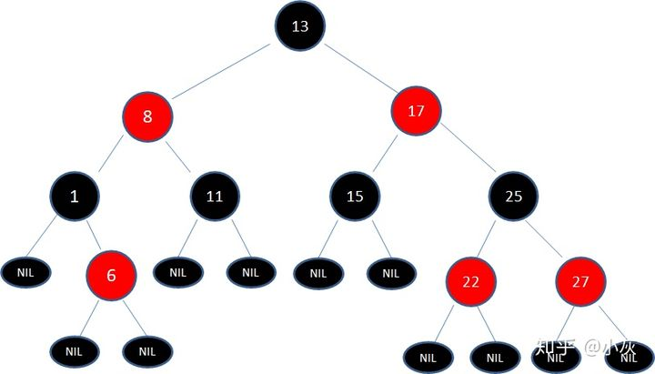


### AVL树（平衡二叉树）：

1. 左右子树的高度差小于等于 1。
2. 其每一个子树均为平衡二叉树。
3. https://zhuanlan.zhihu.com/p/34899732

### AVL树的应用：

由于维护这种高度平衡所付出的代价比从中获得的效率收益还大，故而实际的应用不多，更多的地方是用追求局部而不是非常严格整体平衡的红黑树。当然，如果应用场景中对插入删除不频繁，只是对查找要求较高，那么AVL还是较优于红黑树。

1. Windows NT内核中广泛存在;
2. 数据库查询查询操作较多的情况下；

### **红黑树与AVL树的比较：**

- AVL树的时间复杂度虽然优于红黑树，但是对于现在的计算机，cpu太快，可以忽略性能差异
- 红黑树的插入删除比AVL树更便于控制操作
- 红黑树整体性能略优于AVL树（红黑树旋转情况少于AVL树）

### 红黑树有什么应用呢？

1. 大多数自平衡BST(self-balancing BST) 库函数都是用红黑树实现的，比如C++中的map 和 set （或者 Java 中的 TreeSet 和 TreeMap）。
2. 红黑树也用于实现 Linux 操作系统的 CPU 调度。完全公平调度（Completely Fair Scheduler）使用的就是红黑树。
3. Linux的的进程调度，用红黑树管理进程控制块，进程的虚拟内存空间都存储在一颗红黑树上，每个虚拟内存空间都对应红黑树的一个结点，左指针指向相邻的虚拟内存空间，右指针指向相邻的高地址虚拟内存空间;
4. IO多路复用的epoll采用红黑树组织管理sockfd，以支持快速的增删改查;
5. Nginx中用红黑树管理定时器，因为红黑树是有序的，可以很快的得到距离当前最小的定时器;

## 实现红黑树的基本思想分析

## （一）理解左旋（rotate left）、右旋（rotate right）操作

#### 左旋

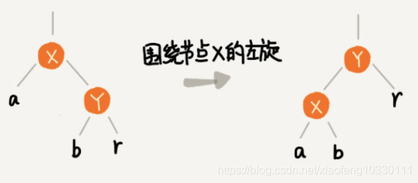

具体代码实现：

```java
/**
     * 功能描述：左旋右侧需要平衡
     *
     * @author yanfengzhang
     * @date 2020-05-27 14:57
     */
    private void rotateLeft(Entry<K, V> p) {
        if (p != null) {
            /*拿到根结点的右子结点 */
            Entry<K, V> r = p.right;    -> y
            /*把根结点的右子结点的左结点，赋值*/
            p.right = r.left;  ->y=r
            if (r.left != null)
                /*将根结点这个值赋值到当前断开的跟结点上*/ {
                r.left.parent = p; ->
            }
            /*r 将来要成为新的根结点 p.parent 为根 ，使得他为新的跟结点 */
            r.parent = p.parent;
            if (p.parent == null) {
                root = r;
            }
            /*如果p 为左孩子，让他还是成为左孩子 同理*/
            else if (p.parent.left == p) {
                p.parent.left = r;
            } else {
                p.parent.right = r;
            }
            /*最后 将当前交换的跟换值*/
            r.left = p;
            p.parent = r;
        }
    }
```

#### 右旋

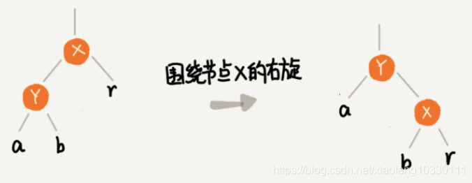

具体代码实现：

```java
    /**
     * 功能描述：右旋代码
     *
     * @author yanfengzhang
     * @date 2020-05-27 14:58
     */
    private void rotateRight(Entry<K, V> p) {
        if (p != null) {
            Entry<K, V> l = p.left;
            p.left = l.right;
            if (l.right != null) {
                l.right.parent = p;
            }
            l.parent = p.parent;
            if (p.parent == null) {
                root = l;
            } else if (p.parent.right == p) {
                p.parent.right = l;
            } else {
                p.parent.left = l;
            }
            l.right = p;
            p.parent = l;
        }
    }
```


## （二）插入操作的平衡调整

**红黑树规定，插入的结点必须是红色的。而且，二叉查找树中新插入的结点都是放在叶子结点上。**

关于插入操作的平衡调整，有这样两种特殊情况：

- 如果插入结点的父结点是黑色的，那我们什么都不用做，它仍然满足红黑树的定义。
- 如果插入的结点是根结点，那我们直接改变它的颜色，把它变成黑色就可以了。

**除此之外，其他情况都会违背红黑树的定义，需要进行调整，调整的过程包含两种基础的操作：左右旋转和改变颜色。**


#### 情况一：如果关注结点是 a，它的叔叔结点 d 是红色

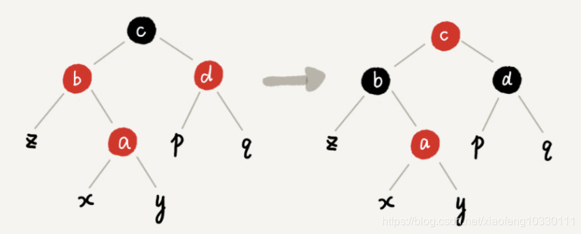

具体操作为：将关注结点 a 的父结点 b、叔叔结点 d 的颜色都设置成黑色；将关注结点 a 的祖父结点 c 的颜色设置成红色；关注结点变成 a 的祖父结点 c；跳到情况二或者情况三。

#### 情况二：如果关注结点是 a，它的叔叔结点 d 是黑色，关注结点 a 是其父结点 b 的右子结点

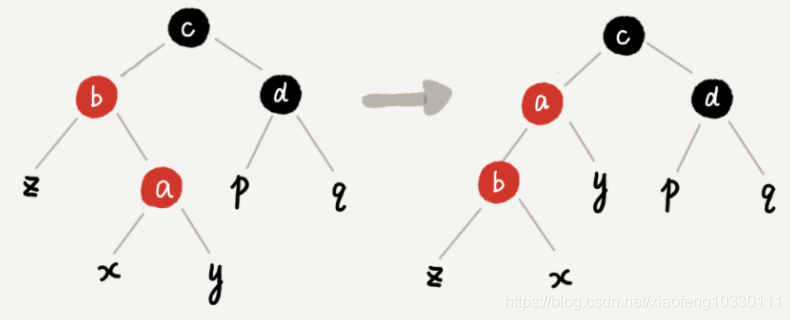

具体操作为：关注结点变成结点 a 的父结点 b；围绕新的关注结点b 左旋；跳到情况三。

#### 情况三：如果关注结点是 a，它的叔叔结点 d 是黑色，关注结点 a 是其父结点 b 的左子结点

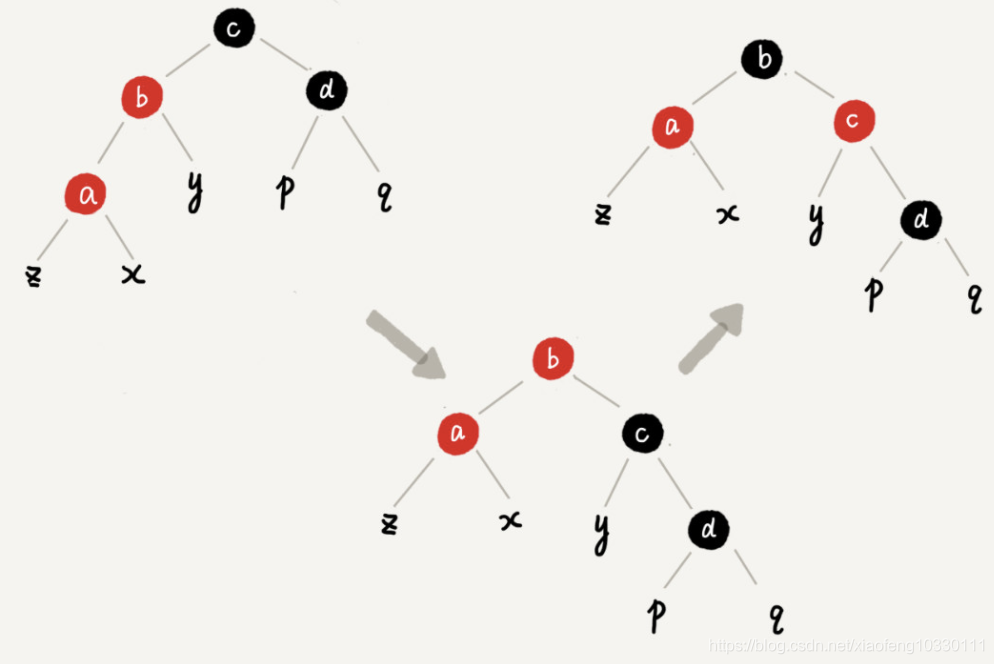

具体操作为：围绕关注结点 a 的祖父结点 c 右旋；将关注结点 a 的父结点 b、兄弟结点 c 的颜色互换，调整结束。

**具体代码：**

```
    /**
     * 功能描述：插入一个结点
     *
     * @author yanfengzhang
     * @date 2020-05-27 15:07
     */
    private void insert(RBTreeNode<T> node) {
        int cmp;
        RBTreeNode<T> root = this.rootNode;
        RBTreeNode<T> parent = null;
 
        /*定位结点添加到哪个父结点下*/
        while (null != root) {
            parent = root;
            cmp = node.key.compareTo(root.key);
            if (cmp < 0) {
                root = root.left;
            } else {
                root = root.right;
            }
        }
 
        node.parent = parent;
        /*表示当前没一个结点，那么就当新增的结点为根结点*/
        if (null == parent) {
            this.rootNode = node;
        } else {
            //找出在当前父结点下新增结点的位置
            cmp = node.key.compareTo(parent.key);
            if (cmp < 0) {
                parent.left = node;
            } else {
                parent.right = node;
            }
        }
 
        /*设置插入结点的颜色为红色*/
        node.color = COLOR_RED;
 
        /*修正为红黑树*/
        insertFixUp(node);
    }
 
    /**
     * 功能描述：红黑树插入修正
     *
     * @author yanfengzhang
     * @date 2020-05-27 15:07
     */
    private void insertFixUp(RBTreeNode<T> node) {
        RBTreeNode<T> parent, gparent;
        /*结点的父结点存在并且为红色*/
        while (((parent = getParent(node)) != null) && isRed(parent)) {
            gparent = getParent(parent);
 
            /*如果其祖父结点是空怎么处理, 若父结点是祖父结点的左孩子*/
            if (parent == gparent.left) {
                RBTreeNode<T> uncle = gparent.right;
                if ((null != uncle) && isRed(uncle)) {
                    setColorBlack(uncle);
                    setColorBlack(parent);
                    setColorRed(gparent);
                    node = gparent;
                    continue;
                }
 
                if (parent.right == node) {
                    RBTreeNode<T> tmp;
                    leftRotate(parent);
                    tmp = parent;
                    parent = node;
                    node = tmp;
                }
 
                setColorBlack(parent);
                setColorRed(gparent);
                rightRotate(gparent);
            } else {
                RBTreeNode<T> uncle = gparent.left;
                if ((null != uncle) && isRed(uncle)) {
                    setColorBlack(uncle);
                    setColorBlack(parent);
                    setColorRed(gparent);
                    node = gparent;
                    continue;
                }
 
                if (parent.left == node) {
                    RBTreeNode<T> tmp;
                    rightRotate(parent);
                    tmp = parent;
                    parent = node;
                    node = tmp;
                }
 
                setColorBlack(parent);
                setColorRed(gparent);
                leftRotate(gparent);
            }
        }
        setColorBlack(this.rootNode);
    }
```


## （三）删除操作的平衡调整

https://zhuanlan.zhihu.com/p/145006031

#### **双黑（Double Black）**

当删除结点 v 是黑色结点，且其被其黑色子结点替换时，其子结点就被标记为 **双黑**

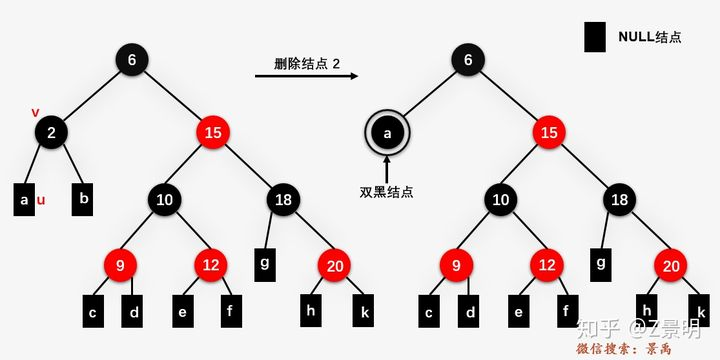

删除操作最主要的任务就可以转化为将双黑结点转化为我们普通黑色结点。


首先我们假定**要删除的结点为 v** ，**u 是**用来替换 v 的**孩子结点**（注意，当 v 是叶结点时， u 是 NULL结点，且NULL结点我们还是当做黑色结点处理）。

删除操作总纲：

1. 执行标准的 BST 的删除操作
2. 简单情况：u 或者 v 是红色
3. 复杂情况：u 和 v 都是黑色结点。

其中第3步又包含三种情况：

​	3.1 u是双黑结点

​	3.2 当前结点u是双黑结点且不是根结点

​	3.3 u当前结点u是双黑结点且是根结点

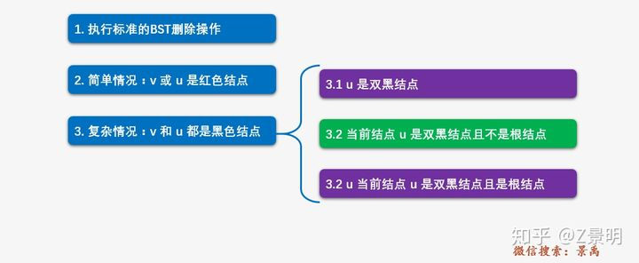

其中的3.2又分为三种情况进行处理：

​	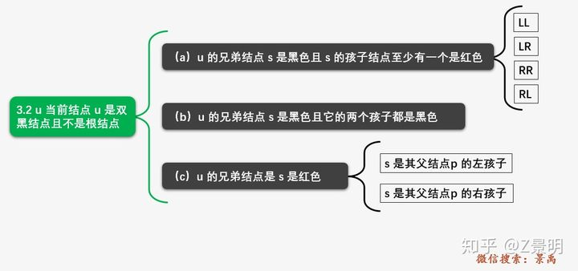

上图中的（a）和（c）又分别包含 4 种和 2 种情况需要处理。


#### 1.执行标准的 BST 的删除操作

**对二叉排序树的删除操作。**在标准的 BST 删除操作中，我们最终都会以删除一个叶子结点或者只有一个孩子的结点而结束（对于内部节点，就是要删除结点左右孩子都存在的情况，最终都会退化到删除结点是叶子结点或者是只有一个孩子的情况）。所以我们仅需要处理被删除结点是叶结点或者仅有一个孩子的情况。


#### 2.简单情况：u 或者 v 是红色

如果 u 或者 v 是红色，我们将替换结点 v 的结点 u 标记为黑色结点（这样黑高就不会变化）。注意这里是 u 或者 v 是红色结点，因为在一棵红黑树中，是不允许有两个相邻的红色结点的，而结点 v 是结点 u 的父结点，因此只能是 u 或者 v 是红色结点。

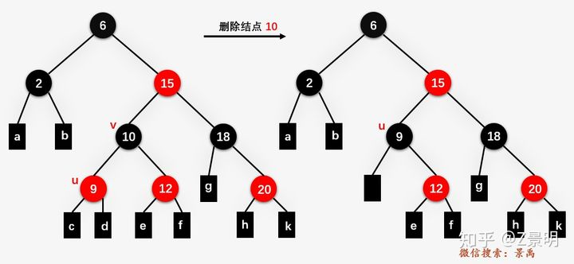


#### 3 复杂情况：u 和 v 都是黑色结点。

当 u 和 v 都是黑色结点时，分为三种情况进行处理：

##### 3.1 结点 u 是双黑结点

当要删除结点 **v** 和孩子结点 **u** 都是黑色结点，删除结点 **v** ，导致结点 **u** 变为双黑结点。当 **u** 变成双黑结点时，我们的主要任务将变成将该双黑结点 **u** 变成普通的单黑结点。一定要特别注意，我们在上篇就提到的，**NULL结点为黑色结点** ， 所以删除黑色的叶子结点就会产生一个双黑结点。

**删除结点u ----  v变成双黑结点 --- v变回为单黑结点**


##### 3.2  当前结点 u 是双黑结点且不是根结点

当前结点 **u** 是双黑结点且不是根结点，又包含三种情况进行处理。说先我们约定结点 **u** 的兄弟结点为 **s** .

###### （a）u 的兄弟结点 s 是黑色且 s 的孩子结点至少有一个是红色

对于这种情况，需要对 **u** 的兄弟结点 **s** 进行旋转操作，我们将 **s** 的一个红色子结点用 **r** 表示，**u** 和 **s** 的父结点用 **p** 表示，那么结点 **p** 、**s** 和 **r** 的位置将出现以下四种情况（LL、LR、RR、RL）。

**LL（s 是 p 的左孩子，r 是 s 的左孩子，或者 s 的两个孩子都是红色结点）：**

删除结点25

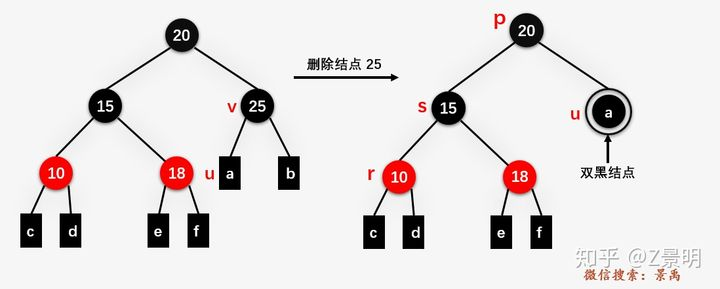


s 的左孩子 r 颜色设置为 s 的颜色，s 的颜色设置为父结点 p 的颜色

右旋结点20(p)

将结点 p的颜色设置为黑色，双黑结点变为单黑结点

**LR（s 是 p 的左孩子，r 是 s 的右孩子，或者 s 的两个孩子都是红色结点）：**

删除结点 **25** ，不过结点 **25** 的兄弟结点 **15** 只有一个右孩子 **18** ；

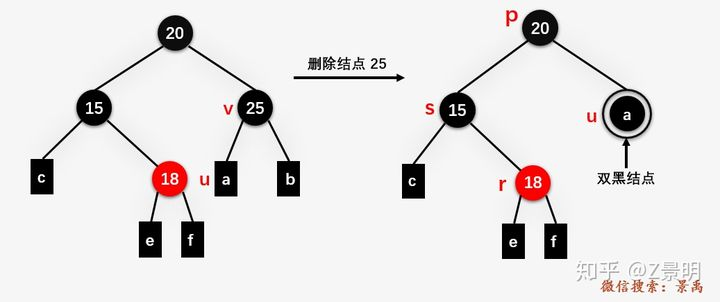

将结点 r 的颜色设置为 p 的颜色

左旋结点15（s）

右旋结点20（p），p的颜色设置为黑色，双黑变单黑

**RR（s 是 p 的右孩子，r 是 s 的右孩子，或者 s 的两个孩子都是红色结点）：**

删除结点 **2** ，用结点 **2** 的NULL结点 **a** 替换结点 **2** ，产生一个双黑结点 **u** ，双黑结点 **u** 的兄弟结点 **s** 为 **15** ，结点 **s** 是其父结点 **6（p）** 的右孩子，其右孩子 **18（r）** 正好是红色结点。即为 **RR** 情况（仔细观察其实和 **LL** 情况是对称的）。

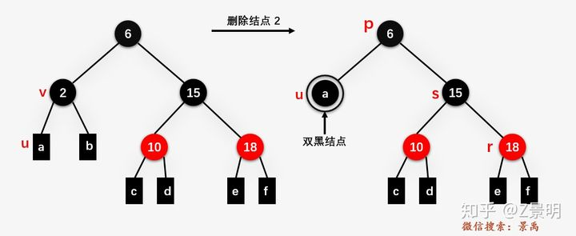

r的颜色变为s的颜色，s的颜色变为p的颜色

左旋p，p的颜色设置为黑色，双黑变单黑

**RL情况（s 是 p 的右孩子，r 是 s 的左孩子，或者 s 的两个孩子都是红色结点）：** 该情况与 **LR情况是对称的**

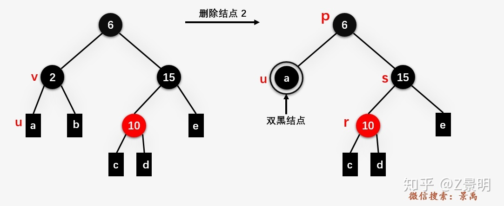

结点 r 的颜色变为 p 的颜色

右旋结点15（s）

左旋结点6（p），p的颜色设置为黑色，双黑变单黑

###### （b）u 的兄弟结点 s 是黑色且 s 的两个孩子结点都是黑色

对于这种情况需要递归地进行处理，如果删除结点后得到的双黑结点的父结点此时为黑色，则结点 **u** 变单黑，且结点 **u** 的父结点 **p** 变双黑，然后对结点 **u** 的父结点 **p** 继续进行处理，直到当前处理的双黑结点的父结点为红色结点，此时将双黑结点的父结点设置为黑色，双黑结点变为单黑结点（红色 + 双黑 = 单黑）。

假设以 **10** 为根结点的子树为整棵树的左子树，删除结点 **9** ，产生双黑结点 **c** 且其兄弟结点 **12（s）** 为黑色，兄弟结点的左右孩子均为黑色。

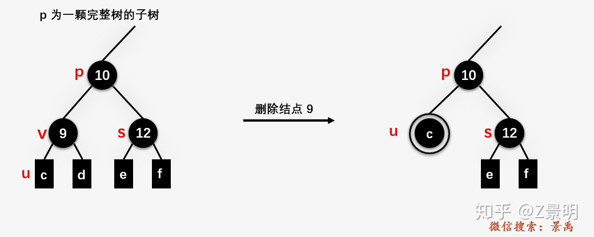

双黑结点的兄弟结点 12 变为红色结点，然后将 u 的父结点 10 变为双黑结点，一直向上判断。(递归)

例子：

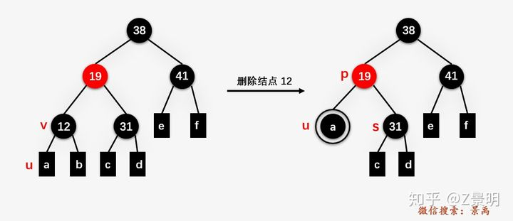

此时只需要将结点 **u** 的兄弟结点 **31** 的颜色变为红色，双黑结点 **u** 的父结点 **19** 由红色变为黑色结点，双黑结点 **u** 变为单黑结点。


###### （c）u 的兄弟结点 s 是红色结点

当前 u 的兄弟结点 s 是红色结点时，通过旋转操作将 u 当前的兄弟结点向上移动，并对 u 的父结点和其旋转前的兄弟结点重新着色，接着继续对结点 u 旋转后的兄弟结点 s 进行判断，确定相应的平衡操作。旋转操作将 u 的兄弟结点情况又会转换为前面刚提到的3.2（a）和（b）的情况。根据兄弟结点 s 是父结点 p 的左右孩子又分为两种情况。

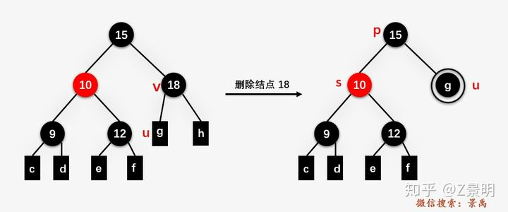

删除结点 **18** ，产生一个双黑结点 **u** ，且 **u** 的兄弟结点 **s** 是红色，兄弟结点 **s** 是其父结点的左孩子，接着就是对其父结点 **15** 进行右旋操作。

对结点 **15** 进行右旋操作，并且对旋转前的 **p** 和 **s** 进行重新着色后，继续对双黑结点旋转后的兄弟结点进行判断，发现此时正好和**3.2（b）**的情况是一样


##### 3.3 当前结点 u 是双黑结点且是根结点

当前结点 **u** 是双黑结点且是根结点时，直接将双黑结点变为单黑结点，整颗红黑树的黑高减 1.


