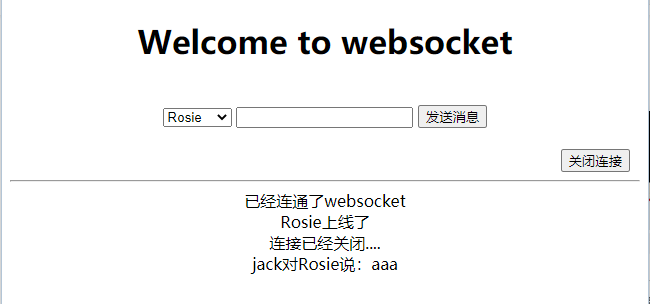

# Websocket

## 概念

`websocket`是`HTML5`中新引进的一种协议，它是一种协议就像(HTTP,FTP在tcp/ip协议栈中属于应用层)而不是简单的一个函数。它本身及基于TCP协议的一种新的协议。

## websocket的产生

websocket是基于web的实时性而产生的，说到这里就不得不要追溯一下web的历史了，在2005年(也就是ajax还没诞生)以前，我们如果想要在一个页面显示显示不同的内容，或者说页面内跳转，只能是通过点击然后路由跳转，在ajax诞生之后，网页开始变得动态了。但是所有的HTTP通信还都是由客户端控制的，这就要需要`长连接`，`定期轮询`或者`流操作`，来和服务器沟通来更新数据。

☞定期轮询(ajax轮询)：浏览器在特定的时间给服务器发送请求，查看服务器是否有信息数据。

☞长连接：其实和上面的原理差不多，是对`ajax轮询`进行了改进和提高。客户端和服务端建立连接之后，一直保持通信(阻塞模式)，如果服务器没有新消息就一直保持通信，知道服务器有新的消息，然后返回给客户端，客户端与服务器断开连接，此时客户端可以继续和服务器进行连接。

☞流操作：常就是在客户端的页面使用一个隐藏的窗口向服务端发出一个长连接的请求。服务器端接到这个请求后作出回应并不断更新连接状态以保证客户端和服务 器端的连接不过期。通过这种机制可以将服务器端的信息源源不断地推向客户端。

结合上面的解释我们来分析一下这三种方式**缺点**：

☛ajax轮询：这种方式带来了没必要的网络传输，是一种最低效的实时方案

☛长期轮询：虽然减少了无效的客户端和服务端的交互，但是数据更新频繁的时候效率并没有明显的增加

☛流操作：这种方式就不言而喻了，对服务器的资源是巨大的考验呀

## websocket解决的问题

### 解决的持久性连接

JavaScript调用浏览器的API发出一个WebSocket请求至服务器，经过三次握手，和服务器建立了TCP通讯，因为它本质 上是一个TCP连接.
为什么要建立持久性连接呢？
这是因为HTTP协议是无状态的，简单来说就是穿了裤子就不认人了(连接断开之后就在也不知道刚才的客户端是谁了)。
websocket这就避免了HTTP的非状态性，服务端会一直知道你的信息，直到你关闭请求。

### 解决耗时和浪费资源

### 服务器反客为主

## WebSocket 协议

客户端发到服务器的内容：

```http
GET /chat HTTP/1.1
Host: server.example.com
Upgrade: websocket
Connection: Upgrade
Sec-WebSocket-Key: dGhlIHNhbXBsZSBub25jZQ==
Origin: http://example.com
Sec-WebSocket-Protocol: chat, superchat
Sec-WebSocket-Version: 13
```

这个比普通的http多了几个陌生的字段，我们来看http协议的的报文：

```http
GET /socket.io/1/xhr-polling/oiO9akCJzXsaVw2GxyoO?t=1464277248268 HTTP/1.1
Host: s3-im-notify.csdn.net
Connection: keep-alive
```
当然一些太没有必要的字段就没有贴出免得占文章篇幅。

我看来看websocket多出的几个字段：

- `Upgrade: websocket`表示这是一个特殊的 HTTP 请求，请求的目的就是要将客户端和服务器端的通讯协议从 HTTP 协议升级到 WebSocket 协议.
- `Sec-WebSocket-Key`: 是一个Base64 encode的值，这个是浏览器随机生成,告诉服务器，我来验证一下你，是不是能和我进行websocket通信
- `Sec_WebSocket-Protocol`:是一个用户定义的字符串，用来区分同URL下，不同的服务所需要的协议
- `Sec-WebSocket-Version`:告诉服务器所使用的协议版本
  我们来看一下服务器给客户端返回的：

```http
HTTP/1.1 101 Switching Protocols
Upgrade: websocket
Connection: Upgrade
Sec-WebSocket-Accept: s3pPLMBiTxaQ9kYGzzhZRbK+xOo=
Sec-WebSocket-Protocol: chat
```
这里主要介绍一下`Sec-WebSocket-Accept`这个字段：经过服务器确认，并且加密过后的 `Sec-WebSocket-Key`。用来证明客户端和服务器之间能进行通信了。


## 代码实现

> 导入包

```xml
<dependency>
    <groupId>org.springframework.boot</groupId>
    <artifactId>spring-boot-starter-thymeleaf</artifactId>
</dependency>
<dependency>
    <groupId>com.alibaba</groupId>
    <artifactId>fastjson</artifactId>
    <version>1.2.75</version>
</dependency>
<dependency>
    <groupId>org.springframework.boot</groupId>
    <artifactId>spring-boot-starter-websocket</artifactId>
</dependency>
```

> 代码

### WebSocket.class

```java

import com.alibaba.fastjson.JSON;
import com.alibaba.fastjson.JSONObject;
import lombok.extern.slf4j.Slf4j;
import org.springframework.stereotype.Component;
import javax.websocket.*;
import javax.websocket.server.PathParam;
import javax.websocket.server.ServerEndpoint;
import java.io.IOException;
import java.util.HashMap;
import java.util.Map;
import java.util.Set;
import java.util.concurrent.ConcurrentHashMap;

@Slf4j
@Component
@ServerEndpoint("/websocket/{username}")
public class WebSocket {
    /**
     * 在线人数
     */
    public static int onlineNumber = 0;
    /**
     * 以用户的姓名为key，WebSocket为对象保存起来
     */
    private static Map<String, WebSocket> clients = new ConcurrentHashMap<String, WebSocket>();
    /**
     * 会话
     */
    private Session session;
    /**
     * 用户名称
     */
    private String username;

    /**
     * OnOpen 表示有浏览器链接过来的时候被调用
     * OnClose 表示浏览器发出关闭请求的时候被调用
     * OnMessage 表示浏览器发消息的时候被调用
     * OnError 表示有错误发生，比如网络断开了等等
     */

    /**
     * 建立连接
     *
     * @param session
     */
    @OnOpen
    public void onOpen(@PathParam("username") String username, Session session) {
        onlineNumber++;
        log.info("现在来连接的客户id：" + session.getId() + "用户名：" + username);
        this.username = username;
        this.session = session;
        log.info("有新连接加入！ 当前在线人数" + onlineNumber);
        try {
            //messageType 1代表上线 2代表下线 3代表在线名单 4代表普通消息
            //先给所有人发送通知，说我上线了
            Map<String, Object> map1 = new HashMap<>();
            map1.put("messageType", 1);
            map1.put("username", username);
            sendMessageAll(JSON.toJSONString(map1), username);

            //把自己的信息加入到map当中去
            clients.put(username, this);
            //给自己发一条消息：告诉自己现在都有谁在线
            Map<String, Object> map2 = new HashMap<>();
            map2.put("messageType", 3);
            //移除掉自己
            Set<String> set = clients.keySet();
            map2.put("onlineUsers", set);
            sendMessageTo(JSON.toJSONString(map2), username);
        } catch (IOException e) {
            log.info(username + "上线的时候通知所有人发生了错误");
        }


    }

    @OnError
    public void onError(Session session, Throwable error) {
        log.info("服务端发生了错误" + error.getMessage());
        //error.printStackTrace();
    }

    /**
     * 连接关闭
     */
    @OnClose
    public void onClose() {
        onlineNumber--;
        //webSockets.remove(this);
        clients.remove(username);
        try {
            //messageType 1代表上线 2代表下线 3代表在线名单  4代表普通消息
            Map<String, Object> map1 = new HashMap<>();
            map1.put("messageType", 2);
            map1.put("onlineUsers", clients.keySet());
            map1.put("username", username);
            sendMessageAll(JSON.toJSONString(map1), username);
        } catch (IOException e) {
            log.info(username + "下线的时候通知所有人发生了错误");
        }
        log.info("有连接关闭！ 当前在线人数" + onlineNumber);
    }

    /**
     * 收到客户端的消息
     *
     * @param message 消息
     * @param session 会话
     */
    @OnMessage
    public void onMessage(String message, Session session) {
        try {
            log.info("来自客户端消息：" + message + "客户端的id是：" + session.getId());
            JSONObject jsonObject = JSON.parseObject(message);
            String textMessage = jsonObject.getString("message");
            String fromusername = jsonObject.getString("username");
            String tousername = jsonObject.getString("to");
            //如果不是发给所有，那么就发给某一个人
            //messageType 1代表上线 2代表下线 3代表在线名单  4代表普通消息
            Map<String, Object> map1 = new HashMap<>();
            map1.put("messageType", 4);
            map1.put("textMessage", textMessage);
            map1.put("fromusername", fromusername);
            if (tousername.equals("All")) {
                map1.put("tousername", "所有人");
                sendMessageAll(JSON.toJSONString(map1), fromusername);
            } else {
                map1.put("tousername", tousername);
                sendMessageTo(JSON.toJSONString(map1), tousername);
            }
        } catch (Exception e) {
            log.info("发生了错误了");
        }
    }

    public void sendMessageTo(String message, String ToUserName) throws IOException {
        for (WebSocket item : clients.values()) {
            if (item.username.equals(ToUserName)) {
                item.session.getAsyncRemote().sendText(message);
                break;
            }
        }
    }

    public void sendMessageAll(String message, String FromUserName) throws IOException {
        for (WebSocket item : clients.values()) {
            item.session.getAsyncRemote().sendText(message);
        }
    }

    public static synchronized int getOnlineCount() {
        return onlineNumber;
    }
}
```

### WebSocketConfig.class

```java
import org.springframework.context.annotation.Bean;
import org.springframework.context.annotation.Configuration;
import org.springframework.web.socket.server.standard.ServerEndpointExporter;
@Configuration
public class WebSocketConfig {
    /**
     * 服务器节点
     * 如果使用独立的servlet容器，而不是直接使用springboot的内置容器，
     * 就不要注入ServerEndpointExporter，因为它将由容器自己提供和管理
     */
    @Bean
    public ServerEndpointExporter serverEndpointExporter() {
        return new ServerEndpointExporter();
    }
}
```

### WebSocketController.class

```java
import lombok.extern.slf4j.Slf4j;
import org.springframework.stereotype.Controller;
import org.springframework.ui.Model;
import org.springframework.web.bind.annotation.PathVariable;
import org.springframework.web.bind.annotation.RequestMapping;
@Slf4j
@Controller
public class WebSocketController {

    @RequestMapping("/websocket/{name}")
    public String webSocket(@PathVariable String name, Model model) {
        try {
            log.info("跳转到websocket的页面上");
            model.addAttribute("username", name);
            return "websocket";
        } catch (Exception e) {
            log.info("跳转到websocket的页面上发生异常，异常信息是：" + e.getMessage());
            return "error";
        }
    }
}
```

### websocket.html

```html
<!DOCTYPE html>
<html xmlns:th="http://www.w3.org/1999/xhtml">
<head>
    <title>websocket</title>
    <script type="text/javascript" src="http://ajax.microsoft.com/ajax/jquery/jquery-1.4.min.js"></script>
    <script src="http://cdn.bootcss.com/stomp.js/2.3.3/stomp.min.js"></script>
    <script src="https://cdn.bootcss.com/sockjs-client/1.1.4/sockjs.min.js"></script>
</head>

<body>
<div style="margin: auto;text-align: center">
    <h1>Welcome to websocket</h1>
</div>
<br/>
<div style="margin: auto;text-align: center">
    <select id="onLineUser">
        <option>--所有--</option>
    </select>
    <input id="text" type="text"/>
    <button onclick="send()">发送消息</button>
</div>
<br>
<div style="margin-right: 10px;text-align: right">
    <button onclick="closeWebSocket()">关闭连接</button>
</div>
<hr/>
<div id="message" style="text-align: center;"></div>
<input type="text" th:value="${username}" id="username" style="display: none"/>
</body>


<script type="text/javascript">
    var webSocket;
    var commWebSocket;
    if ("WebSocket" in window) {
        webSocket = new WebSocket("ws://localhost:8080/websocket/" + document.getElementById('username').value);

        //连通之后的回调事件
        webSocket.onopen = function () {
            //webSocket.send( document.getElementById('username').value+"已经上线了");
            console.log("已经连通了websocket");
            setMessageInnerHTML("已经连通了websocket");
        };

        //接收后台服务端的消息
        webSocket.onmessage = function (evt) {
            var received_msg = evt.data;
            console.log("数据已接收:" + received_msg);
            var obj = JSON.parse(received_msg);
            console.log("可以解析成json:" + obj.messageType);
            //1代表上线 2代表下线 3代表在线名单 4代表普通消息
            if (obj.messageType == 1) {
                //把名称放入到selection当中供选择
                var onlineName = obj.username;
                var option = "<option>" + onlineName + "</option>";
                $("#onLineUser").append(option);
                setMessageInnerHTML(onlineName + "上线了");
            } else if (obj.messageType == 2) {
                $("#onLineUser").empty();
                var onlineName = obj.onlineUsers;
                var offlineName = obj.username;
                var option = "<option>" + "--所有--" + "</option>";
                for (var i = 0; i < onlineName.length; i++) {
                    if (!(onlineName[i] == document.getElementById('username').value)) {
                        option += "<option>" + onlineName[i] + "</option>"
                    }
                }
                $("#onLineUser").append(option);

                setMessageInnerHTML(offlineName + "下线了");
            } else if (obj.messageType == 3) {
                var onlineName = obj.onlineUsers;
                var option = null;
                for (var i = 0; i < onlineName.length; i++) {
                    if (!(onlineName[i] == document.getElementById('username').value)) {
                        option += "<option>" + onlineName[i] + "</option>"
                    }
                }
                $("#onLineUser").append(option);
                console.log("获取了在线的名单" + onlineName.toString());
            } else {
                setMessageInnerHTML(obj.fromusername + "对" + obj.tousername + "说：" + obj.textMessage);
            }
        };

        //连接关闭的回调事件
        webSocket.onclose = function () {
            console.log("连接已关闭...");
            setMessageInnerHTML("连接已经关闭....");
        };
    } else {
        // 浏览器不支持 WebSocket
        alert("您的浏览器不支持 WebSocket!");
    }

    //将消息显示在网页上
    function setMessageInnerHTML(innerHTML) {
        document.getElementById('message').innerHTML += innerHTML + '<br/>';
    }

    function closeWebSocket() {
        //直接关闭websocket的连接
        webSocket.close();
    }

    function send() {
        var selectText = $("#onLineUser").find("option:selected").text();
        if (selectText == "--所有--") {
            selectText = "All";
        } else {
            setMessageInnerHTML(document.getElementById('username').value + "对" + selectText + "说：" + $("#text").val());
        }
        var message = {
            "message": document.getElementById('text').value,
            "username": document.getElementById('username').value,
            "to": selectText
        };
        webSocket.send(JSON.stringify(message));
        $("#text").val("");

    }
</script>

</html>
```

## 效果预览




