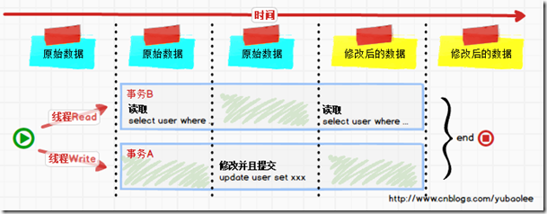

# 认识多线程

### 进程 vs 线程

进程和线程是包含关系，但是多任务既可以由多进程实现，也可以由单进程内的多线程实现，还可以混合多进程＋多线程。

和多线程相比，多进程的缺点在于：

- 创建进程比创建线程开销大，尤其是在Windows系统上；
- 进程间通信比线程间通信要慢，因为线程间通信就是读写同一个变量，速度很快。

而多进程的优点在于：

多进程稳定性比多线程高，因为在多进程的情况下，一个进程崩溃不会影响其他进程，而在多线程的情况下，任何一个线程崩溃会直接导致整个进程崩溃。

### 创建多线程

+ 继承Thread

+ 实现接口Runnable

+ 实现Callable接口

  
  
  ```java
  public class HowToCreateThread {
      static class MyThread extends Thread {
          @Override
          public void run() {
              System.out.println("Hello MyThread!");
          }
      }
      static class MyRun implements Runnable {
          @Override
          public void run() {
              System.out.println("Hello MyRun!");
          }
      }
      static class MyCall implements Callable<String>{
          @Override
          public String call() throws Exception {
              System.out.println("Hello MyCall");
              return "MyCall Sucess";
          }
      }
      public static void main(String[] args) {
          new MyThread().start(); // 第一种
          new Thread(new MyRun()).start(); // 第二种
          new Thread(()->{  // 第三种
              System.out.println("Hello Lambda!");
          }).start();
      }
  }
  ```

Executors.newCachedThrad(线程池创建)本质上是实现Runnable或者Callable接口的方式，lambda表达式本质是实现Runnable接口的方式


### start() VS run()

- 如果执行start方法，则会在主线程中==重新创建一个新的线程==，等得到cpu的时间段后则会执行所对应的run方法体的代码。
- 如果创建了线程对象后，执行run方法，则**还是在主线程中执行，会和调用普通方法一样。按照顺序执行**。

### Sleep & Yield & Join

- Sleep  ==不会释放锁==
  让当前正在执行的线程先暂停一定的时间，并进入阻塞状态。在其睡眠的时间段内，该线程由于不是处于就绪状态，因此不会得到执行的机会。即使此时系统中没有任何其他可执行的线程，处于sleep()中的线程也不会执行。因此sleep()方法常用来暂停线程的执行。当sleep()结束后，然后转入到 Runnable(就绪状态)，这样才能够得到执行的机会。
- Yield   线程让步 ==不会释放锁==
  Thread.yield()方法作用是：暂停当前正在执行的线程对象（及放弃当前拥有的cup资源），并执行其他线程。
       结论：
          yield()从未导致线程转到等待/睡眠/阻塞状态。在大多数情况下，yield()将导致线程从运行状态转到可运行状态，但有可能没有效果。
  和 sleep 一样都是 Thread 类的方法，都是暂停当前正在执行的线程对象，*不会释放资源锁*，和 sleep 不同的是 yield方法并*不会让线程进入阻塞状态*，而是*让线程重回就绪状态*，它只需要等待重新获取CPU执行时间，所以**执行yield()的线程有可能在进入到可执行状态后马上又被执行**。还有一点和 sleep 不同的是 yield 方法只能使同优先级或更高优先级的线程有执行的机会
- Join  
  Thread的非静态方法join()让一个线程等待另外一个线程完成才继续执行。如果线程A执行体中调用B线程的join()方法，则A线程将会被阻塞，直到B线程执行完为止，A才能得以**继续执行**。
- wait
  wait 方法是属于 Object 类中的，wait 过程中线程会释放对象锁，只有当其他线程调用 notify 才能唤醒此线程。wait 使用时必须先获取对象锁，即必须在 synchronized 修饰的代码块中使用，那么相应的 notify 方法同样必须在 synchronized 修饰的代码块中使用，如果没有在synchronized 修饰的代码块中使用时运行时会抛出IllegalMonitorStateException的异常

### 线程状态

线程状态主要有:

`NEW` ：线程刚刚创建的状态 

`RUNNABLE` : 可运行状态，由线程调度器负责调度执行，其中又分为`Ready` （就绪）和`Running` （运行中）状态。`READY` 状态可认为是正在排队等待被调度。

`TimedWaiting` ：隔一段时间会自动唤醒

`Waiting` ：等待被其它线程唤醒

`Blocked` ：被阻塞，正在等待获取锁

`TERMINATED` ：线程结束


# 认识锁概念

### synchronized 锁

对某个对象进行加锁

```java
public class T1 {
    private int count = 10;
    private Object o = new Object();
    private void m1() {
        synchronized (o) { // 任何线程要执行下面的代码，必须先拿到 o 的锁
            count--;
            System.out.println(Thread.currentThread().getName() + " count = " + count);
        }
        // synchronized (this)
    }
    
    public synchronized void m2() {// 这里等价于在方法的代码执行时要synchronized（this）
        count--;
        System.out.println(Thread.currentThread().getName() + " count = " + count);
    }
}
```

### 同步方法和非同步方法

```java
public class T7 {
    private int count = 10;
    public static void main(String[] args) {
        T7 t = new T7();
        /*new Thread(() ->t.m1(),"t1").start();
        new Thread(() ->t.m2(),"t2").start();*/
        new Thread(t::m1, "t1").start();
        new Thread(t::m2, "t2").start();
    }
    public synchronized void m1() {
        System.out.println(Thread.currentThread().getName() + " m1 is start...");
        try { Thread.sleep(10000); } catch (InterruptedException e) {  e.printStackTrace();}
        System.out.println(Thread.currentThread().getName() + " m1 is end");
    }
    public void m2() {
        try { Thread.sleep(2000); } catch (InterruptedException e) {  e.printStackTrace();}
        System.out.println(Thread.currentThread().getName() + " m2 is end");
    }
}
```

> **结果：**  
> t1 m1 is start 。。。
> t2 m2 is end
> t1 m1 is end
>
> **结论：** 同步方法和非同步方法是可以同时调用

### 锁的可重入性

一个同步方法可以调用另外另一个同步方法，个线程已经拥有某个对象的锁，再次申请的时候仍然会得到该对象的锁，也就是说synchronized 获得的锁是可重入的 这里是继承中有可能发生的情形，子类调用父类的同步方法。

```java
public class T2 {
    synchronized void m(){
        System.out.println("m start");
        try { TimeUnit.SECONDS.sleep(1); } catch (InterruptedException e) {  e.printStackTrace(); }
        System.out.println("m end");
    }
    public static void main(String[] args) {
        new TT().m();
    }
}
class TT extends T2{
    @Override
    synchronized void m() {
        System.out.println("child m start");
        super.m();
        System.out.println("child m end");
    }
}
```

>  **结果：** 
> child m start
> m start
> m end
> child m end


# 脏写、脏读、不可重复读和幻读

资源链接：https://www.cnblogs.com/heyu/articles/14598223.html

### 脏写

**Tip：** 脏写，意思是说有两个事务，事务 A 和事务 B 同时在更新一条数据，事务 A 先把它更新为 A 值，事务 B 紧接着就把它更新为 B 值。此时事务B已经完成更新，事务 A 反悔了把数据值回滚成 NULL 了，结果我更新的 B 值也不见 了。所以对于事务 B 看到的场景而言，就是自己明明更新了，结果值却没了，这就是脏写。


### 脏读

**Tip：**A事务执行过程中，B事务读取了A事务的修改。但是由于某些原因，A事务可能没有完成提交，发生RollBack了操作，则B事务所读取的数据就会是不正确的。这个未提交数据就是脏读（Dirty Read）。


### 不可重复读

**Tip：** B事务读取了两次数据，在这两次的读取过程中A事务修改了数据，B事务的这两次读取出来的数据不一样。B事务这种读取的结果，即为不可重复读（Nonrepeatable Read）。



### 幻读

**Tip：** B事务读取了两次数据，在这两次的读取过程中A事务添加了数据，B事务的这两次读取出来的集合不一样。


# 数据库隔离级别

为了解决上面提及的并发问题，主流关系型数据库都会提供四种事务隔离级别。

### 读未提交（Read Uncommitted）

在该隔离级别，所有事务都可以看到其他未提交事务的执行结果。本隔离级别是最低的隔离级别，虽然拥有超高的并发处理能力及很低的系统开销，但很少用于实际应用。因为采用这种隔离级别只能防止第一类更新丢失问题，不能解决脏读，不可重复读及幻读问题。

### 读已提交（Read Committed）

这是大多数数据库系统的默认隔离级别（但不是MySQL默认的）。它满足了隔离的简单定义：一个事务只能看见已经提交事务所做的改变。这种隔离级别可以防止脏读问题，但会出现不可重复读及幻读问题。

### 可重复读（Repeatable Read）

这是MySQL的默认事务隔离级别，它确保同一事务的多个实例在并发读取数据时，会看到同样的数据行。这种隔离级别可以防止除幻读外的其他问题。

### 可串行化（Serializable）

这是最高的隔离级别，它通过强制事务排序，使之不可能相互冲突，从而解决幻读、第二类更新丢失问题。在这个级别，可以解决上面提到的所有并发问题，但可能导致大量的超时现象和锁竞争，通常数据库不会用这个隔离级别，我们需要其他的机制来解决这些问题:乐观锁和悲观锁。

这四种隔离级别会产生的问题如下（网上到处都有，懒得画了）：


