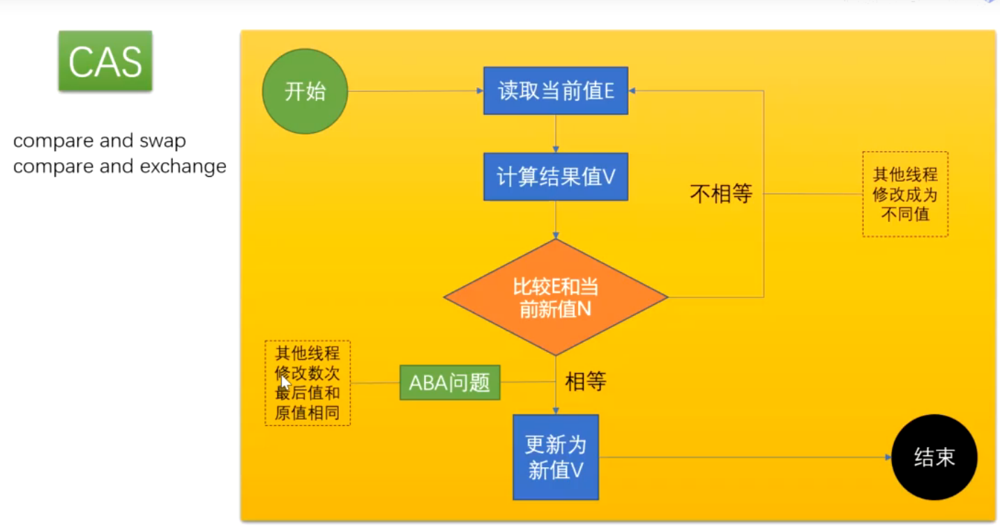
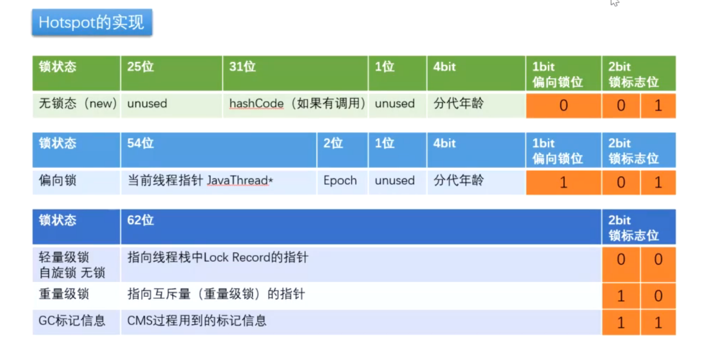

# CAS

## CAE

## CAS 的ABA 问题

什么是ABA问题？

考虑如下操作：

- 并发1（上）：获取出数据的初始值是A，后续计划实施CAS乐观锁，期望数据仍是A的时候，修改才能成功
- 并发2：将数据修改成B
- 并发3：将数据修改回A
- 并发1（下）：CAS乐观锁，检测发现初始值还是A，进行数据修改

上述并发环境下，并发1在修改数据时，虽然还是A，但已经不是初始条件的A了，中间发生了A变B，B又变A的变化，此A已经非彼A，数据却成功修改，可能导致错误，这就是CAS引发的所谓的ABA问题。

ABA问题的优化:

- 加入版本的概念，CAS不能只比对“值”，还必须确保的是原来的数据，才能修改成功。

