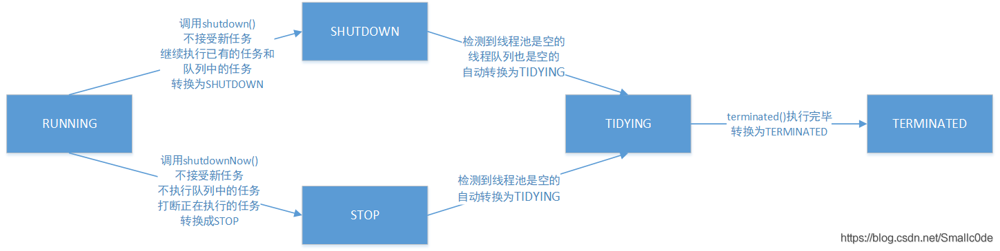

## Executor

https://blog.csdn.net/Smallc0de/article/details/112471912

`Executors`里面的方法很多有兴趣可以自己去看[【Java API传送门】](https://docs.oracle.com/javase/8/docs/api/index.html)。多归多，但是常用的也就那么几个，根据创建的方式不同可以分为下面几个大类：

| 名字                                     | 返回值                   | 说明                                                         |
| ---------------------------------------- | ------------------------ | ------------------------------------------------------------ |
| newFixedThreadPool(int nThreads)         | ExecutorService          | 创建一个固定大小的线程池，其中运行的线程共享一个无边界的队列。可以类比为数组，超出数量的任务要在等待队列中等待。 |
| newCachedThreadPool()                    | ExecutorService          | 创建一个缓冲的线程池。根据需求在其中创建线程，一旦线程被创建，此线程即可被复用。可以类比为只能增加容量的变长数组，如果超出当前容量则创建一个新的线程。 |
| newSingleThreadExecutor()                | ExecutorService          | 创建一个使用单一工作线程的Executor，其运行时共享无边界队列。单例线程池按照不同的次序完成不同的任务，比如上篇例子中就是用这个进行的list添加，提高线程的重用性，才会有相差100倍的运行效果。 |
| newScheduledThreadPool(int corePoolSize) | ScheduledExecutorService | 计划线程池，这种线程池可以用来delay任务，或者执行定时任务。  |

### newFixedThreadPool

```java
long start = System.currentTimeMillis();
getPrime(1, 200000); 
long end = System.currentTimeMillis();
System.out.println(end - start);
final int cpuCoreNum = 4;
ExecutorService service = Executors.newFixedThreadPool(cpuCoreNum);
MyTask t1 = new MyTask(1, 80000); //1-5 5-10 10-15 15-20
MyTask t2 = new MyTask(80001, 130000);
MyTask t3 = new MyTask(130001, 170000);
MyTask t4 = new MyTask(170001, 200000);
Future<List<Integer>> f1 = service.submit(t1);
Future<List<Integer>> f2 = service.submit(t2);
Future<List<Integer>> f3 = service.submit(t3);
Future<List<Integer>> f4 = service.submit(t4);
start = System.currentTimeMillis();
f1.get();
f2.get();
f3.get();
f4.get();
end = System.currentTimeMillis();
System.out.println(end - start);
```

```java
static class MyTask implements Callable<List<Integer>> {
	int startPos, endPos;
	MyTask(int s, int e) {
		this.startPos = s;
		this.endPos = e;
	}
	@Override
	public List<Integer> call() throws Exception {
		List<Integer> r = getPrime(startPos, endPos);
		return r;
	}
}
static boolean isPrime(int num) {
	for(int i=2; i<=num/2; i++) {
		if(num % i == 0) return false;
	}
	return true;
}
static List<Integer> getPrime(int start, int end) {
	List<Integer> results = new ArrayList<>();
	for(int i=start; i<=end; i++) {
		if(isPrime(i)) results.add(i);
	}
	return results;
}
```


### newCachedThreadPool

```java
ExecutorService service = Executors.newCachedThreadPool();
System.out.println(service);
for (int i = 0; i < 2; i++) {
	service.execute(() -> {
		try {
			TimeUnit.MILLISECONDS.sleep(500);
		} catch (InterruptedException e) {
			e.printStackTrace();
		}
		System.out.println(Thread.currentThread().getName());
	});
}
System.out.println(service);
TimeUnit.SECONDS.sleep(10);
System.out.println(service);
```


### newSingleThreadExecutor

```java
ExecutorService service = Executors.newSingleThreadExecutor();
for(int i=0; i<5; i++) {
	final int j = i;
	service.execute(()->{
		System.out.println(j + " " + Thread.currentThread().getName());
	});
}
```


### newScheduledThreadPool

```java
ScheduledExecutorService service = Executors.newScheduledThreadPool(4);
service.scheduleAtFixedRate(()->{
	try {
		TimeUnit.MILLISECONDS.sleep(new Random().nextInt(1000));
	} catch (InterruptedException e) {
		e.printStackTrace();
	}
	System.out.println(Thread.currentThread().getName());
}, 0, 500, TimeUnit.MILLISECONDS);
```


### parallelStream并行流

parallelStream其实就是一个并行执行的流.它通过默认的ForkJoinPool,可能提高你的多线程任务的速度.

https://blog.csdn.net/hz_940611/article/details/80570329

```java
List<Integer> nums = new ArrayList<>();
Random r = new Random();
for(int i=0; i<10000; i++) nums.add(1000000 + r.nextInt(1000000));
long start = System.currentTimeMillis();
nums.forEach(v->isPrime(v));
long end = System.currentTimeMillis();
System.out.println(end - start);
//使用parallel stream api
start = System.currentTimeMillis();
nums.parallelStream().forEach(T13_ParallelStreamAPI::isPrime);
end = System.currentTimeMillis();
System.out.println(end - start);
```

> 2723
> 912
>
> 结果：可以看到使用parallelStream（）可以大幅度提示效率

## 线程池的生命周期

线程池的状态定义在ThreadPoolExecutor里面，下面是官方源码中的注释。

```java
/** 官网定义的状态和说明
*   RUNNING:  Accept new tasks and process queued tasks
*   SHUTDOWN: Don't accept new tasks, but process queued tasks
*   STOP:     Don't accept new tasks, don't process queued tasks,
*             and interrupt in-progress tasks
*   TIDYING:  All tasks have terminated, workerCount is zero,
*             the thread transitioning to state TIDYING
*             will run the terminated() hook method
*   TERMINATED: terminated() has completed
*
* The numerical order among these values matters, to allow
* ordered comparisons. The runState monotonically increases over
* time, but need not hit each state. The transitions are:
* 官网定义的状态转换
* RUNNING -> SHUTDOWN
*    On invocation of shutdown(), perhaps implicitly in finalize()
* (RUNNING or SHUTDOWN) -> STOP
*    On invocation of shutdownNow()
* SHUTDOWN -> TIDYING
*    When both queue and pool are empty
* STOP -> TIDYING
*    When pool is empty
* TIDYING -> TERMINATED
*    When the terminated() hook method has completed
*/

private static final int COUNT_BITS = Integer.SIZE - 3;
private static final int CAPACITY   = (1 << COUNT_BITS) - 1;

// runState is stored in the high-order bits
private static final int RUNNING    = -1 << COUNT_BITS;
private static final int SHUTDOWN   =  0 << COUNT_BITS;
private static final int STOP       =  1 << COUNT_BITS;
private static final int TIDYING    =  2 << COUNT_BITS;
private static final int TERMINATED =  3 << COUNT_BITS;
```

| 状态名称   | 状态名称 | 状态说明                                                     |
| ---------- | -------- | ------------------------------------------------------------ |
| RUNNING    | 运行状态 | RUNNING可以接受任务执行队列里的任务。也就是说线程池被一旦被创建，就处于RUNNING状态，并且线程池中的任务数为0。 |
| SHUTDOWN   | 关闭状态 | 处于SHUTDOWN 状态时，线程池不接收新任务，但是可以继续处理已添加到队列的已有任务。 |
| STOP       | 停止状态 | STOP状态，不接收新任务，不处理已添加的任务，并且会中断正在处理的任务。 |
| TIDYING    | 整理状态 | 当线程池中所有的任务已终止，任务数量为0时，线程池会变为TIDYING状态，并且运行钩子方法terminated()。 |
| TERMINATED | 终止状态 | terminated()运行完成，线程池就会处于这种状态，此状态时线程池彻底终止。 |

注：要注意的是`terminated()`在ThreadPoolExecutor类中是空的。若用户想在线程池变为`TIDYING`时，进行相应的处理，可以通过重载`terminated()`方法来实现。

**状态转换**：线程池的状态之间的转换和线程类似。



**COUNT_BITS** 与 **CAPACITY** ：
解释完状态的转换，就要解释COUNT_BITS的作用了。Integer.SIZE是32表示Integer是32位整型，我们一共只有5个状态，犯得着用Integer.SIZE去表示吗？首先说COUNT_BITS是什么：COUNT_BITS表示线程数量。COUNT_BITS = Integer.SIZE - 3也就是说最多有29位表示线程数量。那么后面的int RUNNING = -1 << COUNT_BITS就好理解了：状态用int型表示，左移29位就是状态，一共32位，高3位是状态，剩下29位就是线程数量。用高3位标识-1(111)、0(000)、1(001)、2(010)、3(011)，因此线程池默认的最大容量CAPACITY 就是29位能表示的最大值2^30-1= ‭536870911‬。


#### ExecutorService.submit()与Executor.execute() 两个方法的相同与不同之处

**相同之处：**

1. Both submit() and execute() methods are used to submit a task to Executor framework for asynchronous execution.
   submit和execute方法均可以想线程池中提交一个任务，让线程池来异步执行这个任务
2. Both submit() and execute() can accept a Runnable task.
   两个方法均可以接受Runnable类型的任务
3. You can access submit() and execute() from the ExecutorService interface because it also extends the Executor interface which declares the execute() method.
   从ExecutorService接口中均可以调用submit和execute方法，但是submit方法是在ExecutorService接口中定义的，而execute方法是在Executor接口中定义的

**不同之处：**

1. The submit() can accept both Runnable and Callable task but execute() can only accept the Runnable task.
   submit方法既能接受有返回结果Callable类型和没有返回结果的Runnable类型，而execute方法只能结构没有返回结果的Runnable类型
2. The submit() method is declared in ExecutorService interface while execute() method is declared in the Executor interface.
   submit方法是定义在ExecutorService接口中的，而execute方法是定义在Executor接口中的
3. The return type of submit() method is a Future object but return type of execute() method is void.
   submit方法的返回值是一个Future，而execute方法的返回值是void
4. 对于异常的处理
   使用submit方式提交的任务若在执行的过程中抛出了异常的话，异常信息会被吃掉（在控制台中看不到），需要通过Future.get方法来获取这个异常；使用execute方式提交的任务若在执行的过程中出现异常的话，异常信息会被打印到控制台

```java
ExecutorService executorService = Executors.newFixedThreadPool(50);

Future<?> future = executorService.submit(() -> {
    System.out.println("submit提交抛出异常的任务");
    try {
        Thread.sleep(3_000);
    } catch (InterruptedException e) {
        e.printStackTrace();
    }
    // 虽然这里出现了异常，但是在控制台不会打印出
    int i = 1 / 0;
});
try {
    // 通过submit提交的任务，如果出现异常的话，可以通过Future.get方法获取到
    System.out.println("submit runnable task and get result: " + future.get());
} catch (ExecutionException ee) {
    System.out.println("1111" + ee);
} catch (InterruptedException ie) {
    System.out.println("2222" + ie);
}

// 通过execute提交的任务，若果任务在执行的过程中出现异常的话，异常的信息将直接被打印出
executorService.execute(() -> {
    System.out.println("execute提交抛出异常的任务");
    try {
        Thread.sleep(4_000);
    } catch (InterruptedException e) {
        e.printStackTrace();
    }
    // 这里出现异常后，会直接在控制台打印出
    int i = 1 / 0;
});
```

#### 什么时候使用这两个方法：

若需要获取异步执行任务的返回值的话，使用submit方法；若仅仅是让一个任务在线程池中异步执行，使用execute方法


## 缓存行

缓存行（Cache Line）是CPU缓存数据的最小单元，从内存读数据到CPU缓存，不是用到什么数据或者当前计算需要什么指令才读取到缓存，而是将周边的数据和指令都一块儿读进来，是按“块”读取的，遵循空间局部性（读周边数据）、时间局部性（读周边指令）原理。相邻的内容读到缓存行中，一般缓存行占64个字节，这是工业实践中得到的缓存行理想的大小，缓存行太大，局部性空间效率越高命中率越高,但是整个缓存行读取变慢;反之读取快但命中率低，因此取了一个折中值。

多线程并发运行时，由于缓存行中会缓存周边数据，就存在一个线程执行的缓存行中缓存了其他线程执行需要的数据，而这些数据对该线程没意义，但是由于缓存行缓存一致性原则确保了，这部分数据也会经过主存做同步。这样增加了线程间同步冗余数据的性能开销，程序的执行效率会降低。因此多线程程序的一个类中定义成员变量时，尽量分散各个线程自身执行的变量（用足够多的long类型的变量填充间隔），也叫缓存行对齐，提升执行效率。典型的源码实现，诸如jdk1.7中的LinkedBlockingQueue、优秀单机版MQ开源框架disruptor的RingBuffer中的一些成员变量就采用了缓存行对齐来大大提升效率。

实现缓存行对齐还可以通过jdk1.8（仅1.8有效）提供的@contended注解来实现，需要注意的是要在jvm启动参数上加:

> -XX:-Restrictcontended

缓存一致性原则由各CPU厂商实现，最有名的是Intel的MESI缓存一致性协议，为cpu的缓存行数据标记了四种状态:Modified、Exclusive、Shared和Invalid，表明了缓存行中数据的不同状态，比如有些数据在缓存行中是独有的，有些是共享状态，对于同一份数据，在一个缓存行中修改了，cpu会主动监听到在另一个缓存行中失效并重新从内存读取，这就从最底层解释了同样的数据处于不同缓存行的不同状态下，执行效率不一样。

```java
public class T02_CacheLinePadding {
    private static class Padding {
        public volatile long p1, p2, p3, p4, p5, p6, p7; // cache line
    }
    private static class T extends Padding {
        public volatile long x = 0L;
    }
    public static T[] arr = new T[2];
    static {
        arr[0] = new T();
        arr[1] = new T();
    }
    public static void main(String[] args) throws Exception {
        Thread t1 = new Thread(()->{
            for (long i = 0; i < 1000_0000L; i++) {
                arr[0].x = i;
            }
        });
        Thread t2 = new Thread(()->{
            for (long i = 0; i < 1000_0000L; i++) {
                arr[1].x = i;
            }
        });
        final long start = System.nanoTime();
        t1.start(); t2.start();
        t1.join(); t2.join();
        System.out.println((System.nanoTime() - start)/100_0000);
    }
}
```

> 运行结果：
>
> 83
>
> 不加缓存行：264
>
> 分析：
>
> 加入缓存行后明显运行时候大幅度下降


## 关于对象半初始化状态

一个Java对象实例化时底层会对应多条汇编指令，拿下面的例子举例:

```java
Class T{
	int m = 8;
}
T t = new T();
```

对应编码

```java
0 new #2 <T>
3 dup
4 invokespecial #3 <T.<init>>
7 astore_1
8 return
```

这里的执行步骤包含了对象刚被初始化时成员变量赋默认值的“半初始化”状态，后续是构造方法初始化对象以及为对象建立引用关联等。

### 重排序造成的this对象逸出

前面的汇编指令可能发生重排序的现象，先将局部变量表中this指向半初始化状态的对象，即先建立对象引用关联，那么这时this引用的对象的属性值还没被初始化，或者叫做this对象逸出。比如下面的程序，这种情况下输出num的值会是0。

```java
public cTass Test2 i
	private int num = 8;
	public Test2() {
		new Thread(()->system.out.println(num) ).start();
	}
	public static void main(string[]args) throws Exception {
		new Test2();
		//确保主程序不会马上结束，构造方法中的线程有机会执行
		System.in.read();
	}
}

```

上面程序改进的点是:在构造方法中只允许创建线程，禁止再调用线程启动方法，应单独写一个方法启动线程，确保在构造方法中初始化玩线程执行需要的变量再启动线程。

